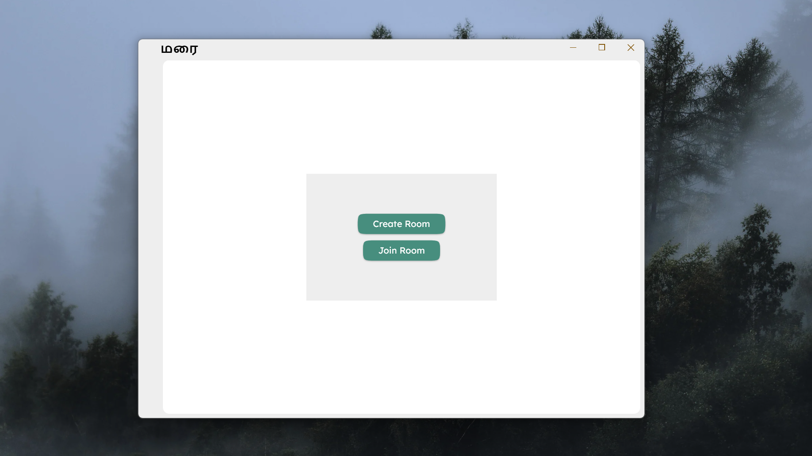
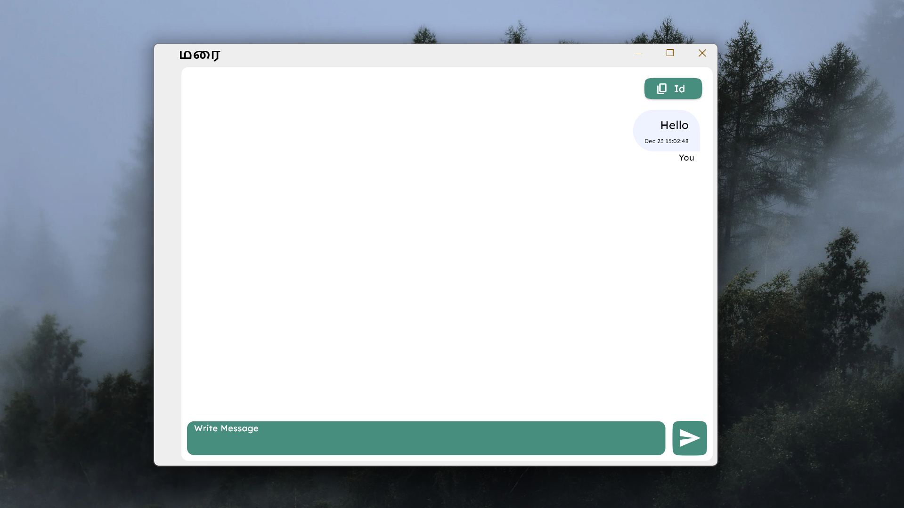

# Marai

A simple and secure **Anonymous Chat App** built using **Flutter** for the frontend and **Supabase** for backend services. This app allows users to send and receive messages anonymously, providing a secure, no-login, no-tracking experience.

## Features

- **Anonymous Messaging**: No login required, users can chat without any personal information.
- **Real-Time Messaging**: Powered by **Supabase**, users can send and receive messages in real-time.
- **Simple UI**: Clean, intuitive interface for smooth interaction.
- **Flutter-based**: Cross-platform application that works on Android, iOS, Web, and Desktop (Windows, Mac, Linux).

## Technologies Used

- **Flutter**: Framework for building natively compiled applications for mobile, web, and desktop from a single codebase.
- **Supabase**: An open-source backend-as-a-service (BaaS) that provides a real-time database, authentication, and more.
- **Dart**: Programming language used with Flutter.

## Screenshots

### Create/Join Room

### Chat Interface

